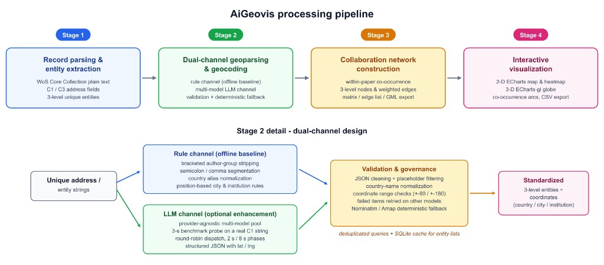

<p align="center">
  
</p>

<p align="center">
  <b>AI-assisted geocoding &amp; collaboration-map visualization for Web of Science records</b><br/>
  面向 WoS 文献地址的智能地理解析与合作网络可视化工具
</p>

<p align="center">
  
  
  
  
  
  <a href="LICENSE"></a>
  <a href="https://github.com/Muzi828/AiGeovis"></a>
</p>

<p align="center">
  <a href="#-overview">Overview</a> ·
  <a href="#-quick-start">Quick Start</a> ·
  <a href="#-features">Features</a> ·
  <a href="#-architecture">Architecture</a> ·
  <a href="#-gallery">Gallery</a> ·
  <a href="#-api">API</a> ·
  <a href="#-docker">Docker</a>
</p>

---

## Overview

**AiGeovis** 把 Web of Science（WoS）导出记录中的作者地址（C1 / C3）解析为国家、机构、城市等地理实体，并在 2D / 3D 地图上展示分布、热力与合作连线。适合文献计量、科研合作网络、机构/国家空间分布等场景。内置 Demo 数据，可零上传先体验全流程。

**Online demo（已部署）：** [https://smartdata.las.ac.cn/AiGeovis/#/home](https://smartdata.las.ac.cn/AiGeovis/#/home)

<p align="center"><b>Main workspace · 2D collaboration map</b></p>
<p align="center">
  
</p>

<p align="center"><b>3D globe · country / region network</b></p>
<p align="center">
  
</p>

<p align="center"><b>Raw data table · imported WoS records</b></p>
<p align="center">
  
</p>

---

## Verified Results

<p align="center"><b>国家 / 地区分布对比</b></p>

| AiGeovis | Web of Science |
|:--------:|:--------------:|
|  |  |

<p align="center"><b>机构分布对比</b></p>

| AiGeovis | Web of Science |
|:--------:|:--------------:|
|  |  |


---

## Features

<p align="center">
  
</p>

<p align="center">
  <sub>Figure 5. AiGeovis processing pipeline and dual-channel geoparsing design</sub>
</p>

- **多源加载**：WoS 导出文件、本地地址 CSV、一键 Demo / 自定义案例
- **分层解析**：C1（国家 / 机构 / 城市）与 C3（机构）独立任务；可批量或按层启动
- **双通道地理解析**：规则基线 + 多模型 LLM；校验失败可重试，并支持 Nominatim / 高德确定性补全
- **增量匹配**：只读 `affiliation_cache.db` 优先命中坐标，未命中再走大模型
- **合作网络**：篇内共现边权 → 实体矩阵 / edge list / GML
- **地图可视化**：散点、热力、合作连线（线宽按共现权重自适应）、三维地球
- **结果导出**：解析表 CSV、实体共现矩阵、GML 下载
- **中英界面**：进度日志与部分 UI 文案支持 `zh` / `en`

---


## Quick Start

### Requirements

- **Python** 3.11+（推荐；`numpy<2` 见 `requirements.txt`）
- **Node.js** 18+
- 可选：大模型 API Key（仅解析未命中参考库的地址时需要）

### 1. Backend

```bash
cd AiGeovis_backend/backend
pip install -r requirements.txt
python -m uvicorn main:app --host 0.0.0.0 --port 35696
```

健康检查：

```bash
curl http://127.0.0.1:35696/api/health
# {"status":"ok","version":"1.2.0"}
```

交互文档：<http://127.0.0.1:35696/docs>

### 2. Frontend

```bash
cd AiGeovis_frontend
npm install
npm run dev
```

本机访问：

```text
http://127.0.0.1:8939/AiGeovis/
```

局域网访问时，前端会按页面 hostname 自动拼接 `http://<host>:35696/api`（见 `src/api/index.js`）。请确保防火墙放行 **8939** 与 **35696**。

### 3. Optional · 本地跳过登录

在 `AiGeovis_frontend/.env.development.local`：

```env
VITE_DISABLE_AUTH=true
```

---

## Project Layout

```text
AiGeovis_code/
├── README.md
├── LICENSE                      # Apache License 2.0
├── docs/assets/                 # README 配图与界面截图
├── AiGeovis_frontend/           # Vue 前端
│   ├── src/views/HomeView.vue   # 主工作台
│   ├── src/views/VizView.vue    # 地图可视化
│   └── vite.config.js
├── AiGeovis_backend/
│   ├── backend/                 # FastAPI 应用
│   │   ├── main.py              # 入口
│   │   ├── api/                 # 路由
│   │   ├── geo/                 # 解析 / 编码 / 参考库
│   │   ├── services/            # 矩阵 · 可视化 · GML
│   │   ├── core/i18n.py         # 中文文案集中管理
│   │   └── build_reference_db.py
│   ├── demoData/                # 内置案例数据
│   ├── Dockerfile
│   ├── docker-compose.yml
│   └── DEPLOY.md
└── Verified Results/            # 对照验证图与样例
```

---

## Demo Walkthrough

1. 打开前端（或线上 Demo）→ **Open Demo**（WoS）或自定义地址案例
2. 左侧选择 C1 / C3 与解析层级 → **Start Parse**（Demo 已预解析时可直接看图）
3. 右侧切换 **Map / 3D Map / Density**，调节节点大小、连线粗细与颜色
4. 使用 **Open Table / Export** 查看或下载结果

| Demo 资源 | 路径 / API |
|-----------|------------|
| 案例 JSON / 矩阵 | `AiGeovis_backend/demoData/` |
| 列表接口 | `GET /api/demo/files` |
| 数据接口 | `GET /api/demo/data/{name}` |
| GML 下载 | `GET /api/demo/gml/download?filename=...` |

---

## API

主要分组（完整见 Swagger `/docs` 与 `AiGeovis_backend/docs/`）：

| 分组 | 前缀 | 说明 |
|------|------|------|
| Health | `/api/health` | 存活检查 |
| Data | `/api/data/*` | 上传、Session、去重 |
| Parse | `/api/geo/parse-*` | C1 / C3 / affiliation 解析与进度 |
| Results | `/api/geo/results` | 分页结果 |
| Viz | `/api/geo/viz-data` · `/api/geo/stats` | 可视化数据 |
| Matrix | `/api/geo/entity-matrix` | 实体共现与导出 |
| Demo | `/api/demo/*` | 内置案例 |

---

## Docker

在 `AiGeovis_backend/` 目录：

```bash
docker compose build
docker compose up -d
curl http://localhost:35696/api/health
```

详见 [`AiGeovis_backend/DEPLOY.md`](AiGeovis_backend/DEPLOY.md)。

> 镜像默认只部署后端；前端可另行 `npm run build` 后由 Nginx 托管，或继续用 Vite 开发服务器联调。

---

## Rebuild Reference Database

运行时解析会只读查询 `backend/affiliation_cache.db`。若需从全量坐标 CSV **重建**该库：

```bash
cd AiGeovis_backend/backend
python build_reference_db.py <path-to-csv-dir>
```

CSV 需包含：`coords_countries.csv`、`coords_affiliations.csv`、`coords_affil_dept.csv`。  
该目录通常位于仓库外；与 `demoData/` 示例数据无关。大文件默认已在 `.gitignore` 中忽略。

---

## Configuration Cheatsheet

| 项 | 值 |
|----|----|
| Online demo | [https://smartdata.las.ac.cn/AiGeovis/#/home](https://smartdata.las.ac.cn/AiGeovis/#/home) |
| Frontend URL | `http://<host>:8939/AiGeovis/` |
| Backend URL | `http://<host>:35696` |
| API Base (dev) | `http://<host>:35696/api` |
| Vite proxy | `/api` → `127.0.0.1:35696` |
| Auth bypass | `VITE_DISABLE_AUTH=true` |

---

## Roadmap / Notes for Contributors

- [ ] 补齐生产环境前端静态资源 Docker / Nginx 示例
- [ ] 为公开仓库补充正式论文引用条目（DOI）
- [ ] CI：后端 health + 前端 build 冒烟

欢迎 Issue / PR。提交前请避免把 API Key、`.env*`、`affiliation_cache.db`、`node_modules` 推入远程。

---

## Citation

若本工具对你的研究有帮助，请引用相关论文（发表后在此补充 DOI）。验证样例见：

```text
Verified Results/Result/
Verified Results/SoftwareX_2025_450/
```

---

## License

本项目采用 [Apache License 2.0](LICENSE) 开源协议。

---

<p align="center">
  <sub>AiGeovis · AI + Geo Visualization for bibliometric address data</sub>
</p>
