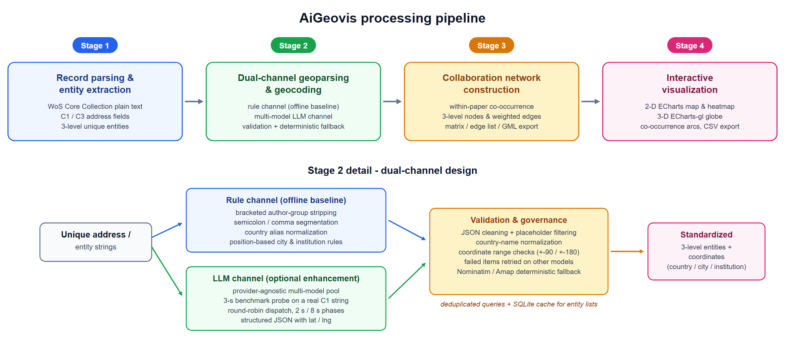

<p align="center">
  
</p>

<p align="center">
  <a href="README.md"><b>English</b></a> ·
  <a href="README.zh-CN.md">中文</a>
</p>

<p align="center">
  <b>AI-assisted geocoding &amp; collaboration-map visualization for Web of Science records</b>
</p>

<p align="center">
  
  
  
  
  
  <a href="LICENSE"></a>
  <a href="https://github.com/Muzi828/AiGeovis"></a>
</p>

<p align="center">
  <a href="#overview">Overview</a> ·
  <a href="#verified-results">Verified Results</a> ·
  <a href="#features">Features</a> ·
  <a href="#quick-start">Quick Start</a> ·
  <a href="#project-layout">Project Layout</a> ·
  <a href="#api">API</a> ·
  <a href="#docker">Docker</a> ·
  <a href="#configuration-cheatsheet">Configuration</a> ·
  <a href="#license">License</a>
</p>

---

## Overview

AiGeovis parses author affiliations (C1 / C3) from records exported by Web of Science (WoS) into geographic entities including countries, institutions and cities, and complements their corresponding longitude and latitude coordinates. This is implemented via reference database matching combined with multi-model LLM-based geographic parsing, with geocoding adopted as a fallback when necessary. The tool further visualizes distribution patterns, heatmaps and collaborative links on both 2D and 3D maps. It fits research scenarios such as bibliometric analysis, scientific collaboration network construction, and spatial distribution analysis of institutions or countries. Preloaded demo data is provided to enable users to experience the full workflow without uploading custom datasets.

**Online demo:** [https://smartdata.las.ac.cn/AiGeovis/#/home](https://smartdata.las.ac.cn/AiGeovis/#/home)

<p align="center"><b>Raw data table · imported WoS records</b></p>
<p align="center">
  <a href="docs/assets/ui-raw-table.png">
    
  </a>
</p>

<p align="center"><b>Main workspace · 2D collaboration map</b></p>
<p align="center">
  <a href="docs/assets/ui-2d-map.png">
    
  </a>
</p>

<p align="center"><b>3D globe · country / region network</b></p>
<p align="center">
  <a href="docs/assets/ui-3d-globe.png">
    
  </a>
</p>

---

## Verified Results

<p align="center"><b>Countries / regions</b></p>

| AiGeovis | Web of Science |
|:--------:|:--------------:|
| <a href="docs/assets/map-countries-aigeovis.png"></a> | <a href="docs/assets/map-countries-wos.png"></a> |

<p align="center"><b>Organizations</b></p>

| AiGeovis | Web of Science |
|:--------:|:--------------:|
| <a href="docs/assets/map-affiliations-aigeovis.png"></a> | <a href="docs/assets/map-affiliations-wos.png"></a> |

---

## Features

<p align="center">
  <a href="docs/assets/fig1-workflow.png">
    
  </a>
</p>

<p align="center">
  <sub>AiGeovis processing pipeline and dual-channel geoparsing design</sub>
</p>

- **Multi-source ingest**: WoS exports, local address CSV, one-click demo / custom samples
- **Tiered parsing**: C1 (country / organization / city) and C3 (organization) as independent jobs
- **Dual-channel geoparsing**: rule baseline + multi-model LLM; retries on validation failure; Nominatim / Amap fallback
- **Incremental matching**: read-only `affiliation_cache.db` first; LLM only for misses
- **Collaboration network**: within-paper co-occurrence weights → entity matrix / edge list / GML
- **Map visualization**: scatter, heatmap, weighted edges, 3D globe
- **Exports**: parsed tables (CSV), co-occurrence matrix, GML
- **Bilingual UI**: progress logs and selected UI strings support `zh` / `en`

---

## Quick Start

### Requirements

- **Python** 3.11+ (recommended; see `numpy<2` in `requirements.txt`)
- **Node.js** 18+
- Optional: LLM API key (needed only for addresses not hit in the reference library)

### 1. Backend

```bash
cd AiGeovis_backend/backend
pip install -r requirements.txt
python -m uvicorn main:app --host 0.0.0.0 --port 35696
```

Health check:

```bash
curl http://127.0.0.1:35696/api/health
# {"status":"ok","version":"1.2.0"}
```

Interactive docs: <http://127.0.0.1:35696/docs>

### 2. Frontend

```bash
cd AiGeovis_frontend
npm install
npm run dev
```

Local URL:

```text
http://127.0.0.1:8939/AiGeovis/
```

On a LAN, the frontend builds the API base from the page hostname as `http://<host>:35696/api` (see `src/api/index.js`). Allow firewall ports **8939** and **35696**.

---

## Project Layout

```text
AiGeovis_code/
├── README.md                    # English (this file)
├── README.zh-CN.md              # 中文说明
├── LICENSE                      # Apache License 2.0
├── docs/assets/                 # README images
├── AiGeovis_frontend/           # Vue frontend
│   ├── src/views/HomeView.vue
│   ├── src/views/VizView.vue
│   └── vite.config.js
├── AiGeovis_backend/
│   ├── backend/                 # FastAPI app
│   │   ├── main.py
│   │   ├── api/
│   │   ├── geo/
│   │   ├── services/
│   │   ├── core/i18n.py
│   │   └── build_reference_db.py
│   ├── demoData/
│   ├── Dockerfile
│   ├── docker-compose.yml
│   └── DEPLOY.md
└── Verified Results/
```

---

## API

Main groups (full list in Swagger `/docs` and `AiGeovis_backend/docs/`):

| Group | Prefix | Description |
|------|------|------|
| Health | `/api/health` | Liveness |
| Data | `/api/data/*` | Upload, session, dedup |
| Parse | `/api/geo/parse-*` | C1 / C3 / affiliation parse & progress |
| Results | `/api/geo/results` | Paginated results |
| Viz | `/api/geo/viz-data` · `/api/geo/stats` | Visualization payloads |
| Matrix | `/api/geo/entity-matrix` | Co-occurrence & export |
| Demo | `/api/demo/*` | Built-in samples |

---

## Docker

Under `AiGeovis_backend/`:

```bash
docker compose build
docker compose up -d
curl http://localhost:35696/api/health
```

See [`AiGeovis_backend/DEPLOY.md`](AiGeovis_backend/DEPLOY.md).

> The image ships the backend by default. Serve the frontend via `npm run build` + Nginx, or keep using the Vite dev server.

---

## Rebuild Reference Database

Runtime parsing reads `backend/affiliation_cache.db` (read-only). To **rebuild** it from full coordinate CSVs:

```bash
cd AiGeovis_backend/backend
python build_reference_db.py <path-to-csv-dir>
```

Required files: `coords_countries.csv`, `coords_affiliations.csv`, `coords_affil_dept.csv`.  
That directory usually lives outside the repo and is unrelated to `demoData/`. Large DB files are ignored via `.gitignore`.

---

## Configuration Cheatsheet

| Item | Value |
|----|----|
| Online demo | [https://smartdata.las.ac.cn/AiGeovis/#/home](https://smartdata.las.ac.cn/AiGeovis/#/home) |
| Frontend URL | `http://<host>:8939/AiGeovis/` |
| Backend URL | `http://<host>:35696` |
| API Base (dev) | `http://<host>:35696/api` |
| Vite proxy | `/api` → `127.0.0.1:35696` |
| Auth bypass | `VITE_DISABLE_AUTH=true` |

---

## Citation

If AiGeovis helps your research, please cite the related paper (DOI to be added after publication). Verification samples:

```text
Verified Results/Result/
Verified Results/SoftwareX_2025_450/
```

---

## License

This project is released under the [Apache License 2.0](LICENSE).

---

<p align="center">
  <sub>AiGeovis · AI + Geo Visualization for bibliometric address data</sub>
</p>
