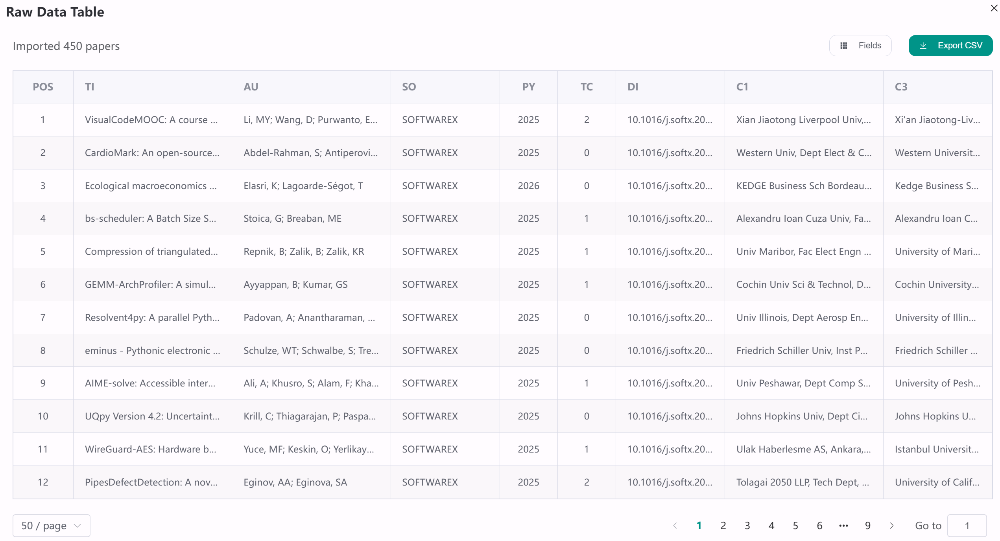
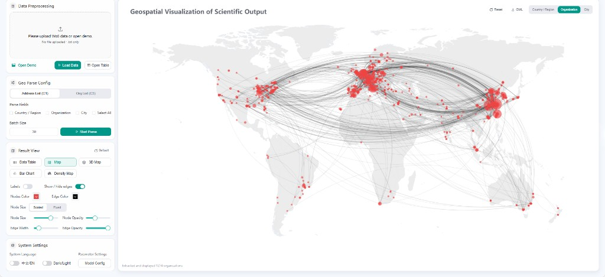
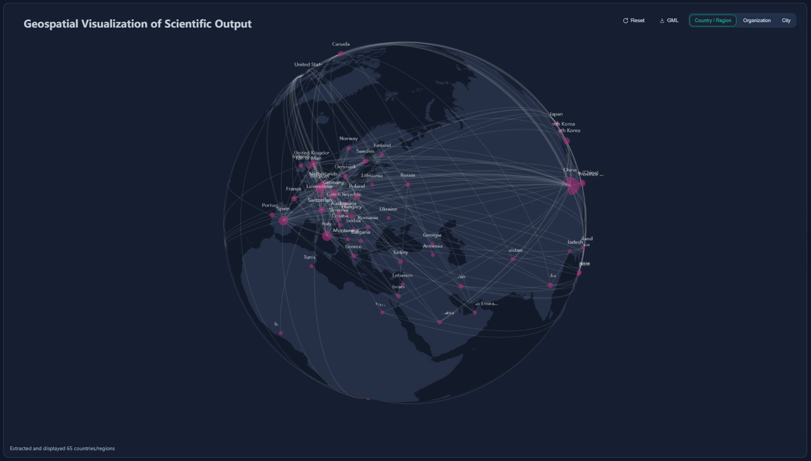
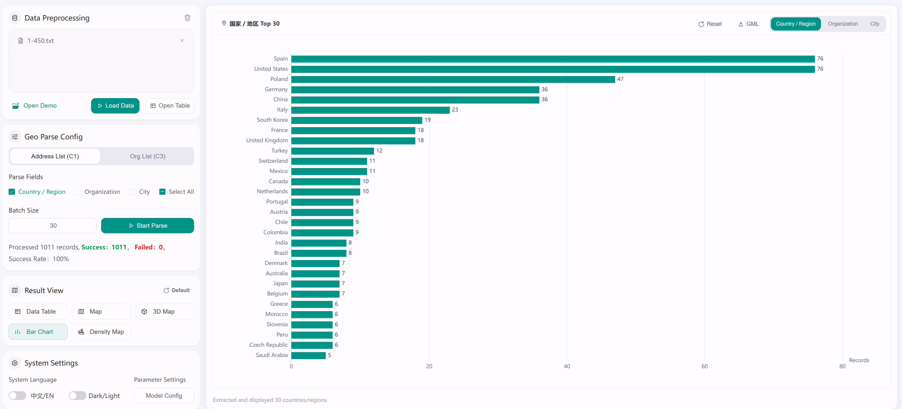
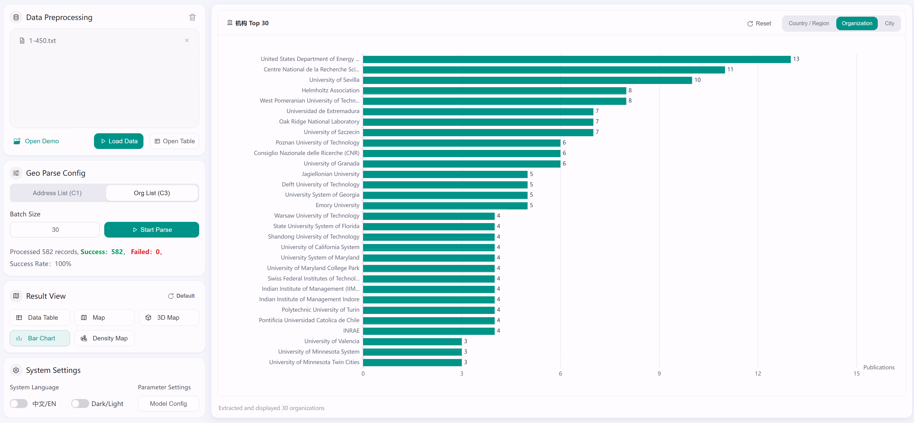
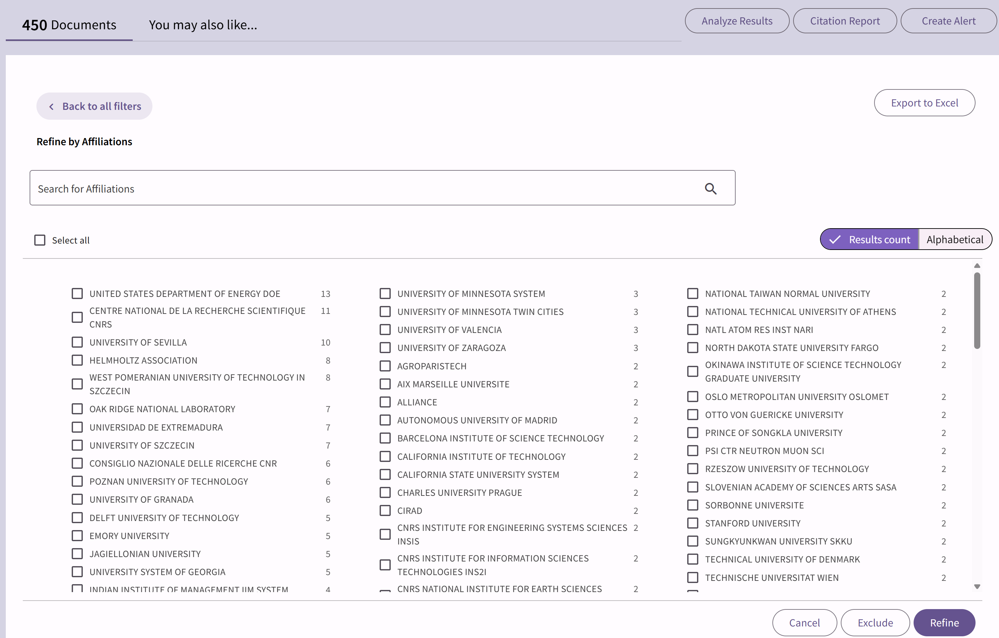
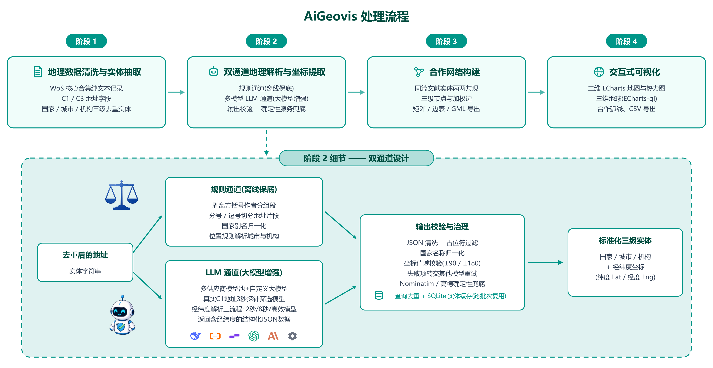

<p align="center">
  
</p>

<p align="center">
  <a href="README.md">English</a> ·
  <a href="README.zh-CN.md"><b>中文</b></a>
</p>

<p align="center">
  <b>面向 WoS 文献地址的智能地理解析与合作网络可视化工具</b>
</p>

<p align="center">
  
  
  
  
  
  <a href="LICENSE"></a>
  <a href="https://github.com/Muzi828/AiGeovis"></a>
</p>

<p align="center">
  <a href="#项目简介">项目简介</a> ·
  <a href="#验证结果">验证结果</a> ·
  <a href="#功能特性">功能特性</a> ·
  <a href="#快速开始">快速开始</a> ·
  <a href="#项目结构">项目结构</a> ·
  <a href="#api">API</a> ·
  <a href="#docker">Docker</a> ·
  <a href="#配置速查">配置速查</a> ·
  <a href="#许可证">许可证</a>
</p>

---

## 项目简介

AiGeovis 可解析从 Web of Science（WoS）导出记录中的作者单位地址字段（C1 / C3），拆分出国家、机构、城市等地理实体，并为其补全经纬度坐标。系统采用参考库匹配结合多大型语言模型地理解析的方案实现坐标匹配，信息缺失时将调用地理编码作为兜底补充。
工具支持在二维、三维地图中可视化科研主体的空间分布、热力图与合作关联连线，适用于文献计量分析、科研合作网络构建、机构 / 国家空间分布研究等场景。软件内置演示数据集，用户无需上传自有数据即可完整体验全部分析流程。

**线上演示：** [https://smartdata.las.ac.cn/AiGeovis/#/home](https://smartdata.las.ac.cn/AiGeovis/#/home)

<p align="center"><b>原始数据表 · 已导入的 WoS 记录</b></p>
<p align="center">
  <a href="docs/assets/ui-raw-table.png">
    
  </a>
</p>

<p align="center"><b>主工作台 · 二维合作网络地图</b></p>
<p align="center">
  <a href="docs/assets/ui-2d-map.png">
    
  </a>
</p>

<p align="center"><b>三维地球 · 国家 / 地区网络</b></p>
<p align="center">
  <a href="docs/assets/ui-3d-globe.png">
    
  </a>
</p>

---

## 验证结果

<p align="center"><b>国家 / 地区分布对比</b></p>

| AiGeovis | Web of Science |
|:--------:|:--------------:|
| <a href="docs/assets/map-countries-aigeovis.png"></a> | <a href="docs/assets/map-countries-wos.png"></a> |

<p align="center"><b>机构分布对比</b></p>

| AiGeovis | Web of Science |
|:--------:|:--------------:|
| <a href="docs/assets/map-affiliations-aigeovis.png"></a> | <a href="docs/assets/map-affiliations-wos.png"></a> |

---

## 功能特性

<p align="center">
  <a href="docs/assets/fig1-workflow-zh.png">
    
  </a>
</p>

<p align="center">
  <sub>AiGeovis 处理流程与双通道地理解析设计</sub>
</p>

- **多源加载**：WoS 导出文件、本地地址 CSV、一键 Demo / 自定义案例
- **分层解析**：C1（国家 / 机构 / 城市）与 C3（机构）独立任务；可批量或按层启动
- **双通道地理解析**：规则基线 + 多模型 LLM；校验失败可重试，并支持 Nominatim / 高德确定性补全
- **增量匹配**：只读 `affiliation_cache.db` 优先命中坐标，未命中再走大模型
- **合作网络**：篇内共现边权 → 实体矩阵 / edge list / GML
- **地图可视化**：散点、热力、合作连线（线宽按共现权重自适应）、三维地球
- **结果导出**：解析表 CSV、实体共现矩阵、GML 下载
- **中英界面**：进度日志与部分 UI 文案支持 `zh` / `en`

---

## 快速开始

### 环境要求

- **Python** 3.11+（推荐；`numpy<2` 见 `requirements.txt`）
- **Node.js** 18+
- 可选：大模型 API Key（仅解析未命中参考库的地址时需要）

### 1. 后端

```bash
cd AiGeovis_backend/backend
pip install -r requirements.txt
python -m uvicorn main:app --host 0.0.0.0 --port 35696
```

健康检查：

```bash
curl http://127.0.0.1:35696/api/health
# {"status":"ok","version":"1.2.0"}
```

交互文档：<http://127.0.0.1:35696/docs>

### 2. 前端

```bash
cd AiGeovis_frontend
npm install
npm run dev
```

本机访问：

```text
http://127.0.0.1:8939/AiGeovis/
```

局域网访问时，前端会按页面 hostname 自动拼接 `http://<host>:35696/api`（见 `src/api/index.js`）。请确保防火墙放行 **8939** 与 **35696**。

---

## 项目结构

```text
AiGeovis_code/
├── README.md                    # English
├── README.zh-CN.md              # 中文说明（本文件）
├── LICENSE                      # Apache License 2.0
├── docs/assets/                 # README 配图与界面截图
├── AiGeovis_frontend/           # Vue 前端
│   ├── src/views/HomeView.vue   # 主工作台
│   ├── src/views/VizView.vue    # 地图可视化
│   └── vite.config.js
├── AiGeovis_backend/
│   ├── backend/                 # FastAPI 应用
│   │   ├── main.py              # 入口
│   │   ├── api/                 # 路由
│   │   ├── geo/                 # 解析 / 编码 / 参考库
│   │   ├── services/            # 矩阵 · 可视化 · GML
│   │   ├── core/i18n.py         # 中文文案集中管理
│   │   └── build_reference_db.py
│   ├── demoData/                # 内置案例数据
│   ├── Dockerfile
│   ├── docker-compose.yml
│   └── DEPLOY.md
└── Verified Results/            # 对照验证图与样例
```

---

## API

主要分组（完整见 Swagger `/docs` 与 `AiGeovis_backend/docs/`）：

| 分组 | 前缀 | 说明 |
|------|------|------|
| Health | `/api/health` | 存活检查 |
| Data | `/api/data/*` | 上传、Session、去重 |
| Parse | `/api/geo/parse-*` | C1 / C3 / affiliation 解析与进度 |
| Results | `/api/geo/results` | 分页结果 |
| Viz | `/api/geo/viz-data` · `/api/geo/stats` | 可视化数据 |
| Matrix | `/api/geo/entity-matrix` | 实体共现与导出 |
| Demo | `/api/demo/*` | 内置案例 |

---

## Docker

在 `AiGeovis_backend/` 目录：

```bash
docker compose build
docker compose up -d
curl http://localhost:35696/api/health
```

详见 [`AiGeovis_backend/DEPLOY.md`](AiGeovis_backend/DEPLOY.md)。

> 镜像默认只部署后端；前端可另行 `npm run build` 后由 Nginx 托管，或继续用 Vite 开发服务器联调。

---

## 重建参考库

运行时解析会只读查询 `backend/affiliation_cache.db`。若需从全量坐标 CSV **重建**该库：

```bash
cd AiGeovis_backend/backend
python build_reference_db.py <path-to-csv-dir>
```

CSV 需包含：`coords_countries.csv`、`coords_affiliations.csv`、`coords_affil_dept.csv`。  
该目录通常位于仓库外；与 `demoData/` 示例数据无关。大文件默认已在 `.gitignore` 中忽略。

---

## 配置速查

| 项 | 值 |
|----|----|
| 线上演示 | [https://smartdata.las.ac.cn/AiGeovis/#/home](https://smartdata.las.ac.cn/AiGeovis/#/home) |
| 前端地址 | `http://<host>:8939/AiGeovis/` |
| 后端地址 | `http://<host>:35696` |
| API Base（开发） | `http://<host>:35696/api` |
| Vite 代理 | `/api` → `127.0.0.1:35696` |
| 跳过登录 | `VITE_DISABLE_AUTH=true` |

---

## 引用

若本工具对你的研究有帮助，请引用相关论文（发表后在此补充 DOI）。验证样例见：

```text
Verified Results/Result/
Verified Results/SoftwareX_2025_450/
```

---

## 许可证

本项目采用 [Apache License 2.0](LICENSE) 开源协议。

---

<p align="center">
  <sub>AiGeovis · AI + Geo Visualization for bibliometric address data</sub>
</p>
